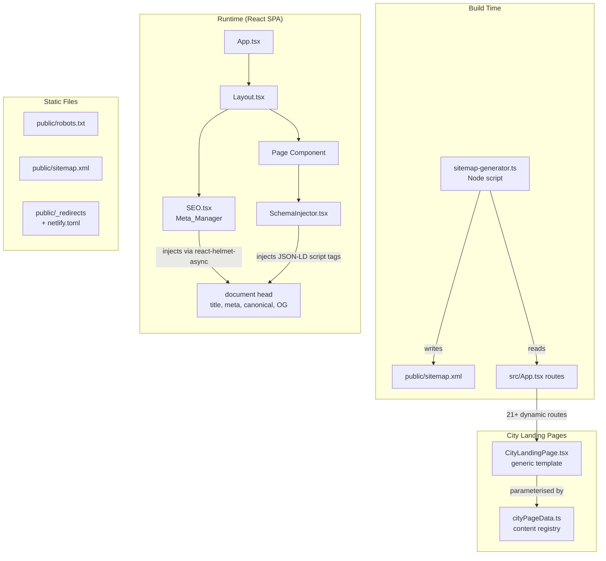

# Design Document: SEO Optimisation — ecommittra.com

## Overview

This design covers the end-to-end SEO implementation for ecommittra.com, a React/TypeScript SPA (Vite + Tailwind + shadcn/ui) deployed on Netlify.

The site currently has a single `index.html` entry point with static meta tags and two JSON-LD blocks (Organization + LocalBusiness), 22 service pages using a shared `ServicePageTemplate`, and a `public/sitemap.xml` maintained manually. The key architectural challenge is that a client-side SPA does not produce server-rendered HTML by default, so all `<head>` tag injection must happen at runtime via a dedicated React head management library.

The design addresses eight concern areas from the requirements: technical SEO, on-page meta management, structured data, city-targeted landing pages, local/brand SEO, backlink process, domain protection, and monthly reporting.

---

## Architecture

### High-Level Architecture



### Key Design Decisions

**1. react-helmet-async for head management.** The site is a pure SPA with no SSR. `react-helmet-async` is the established library for injecting `<title>`, `<meta>`, `<link rel="canonical">`, and `<script type="application/ld+json">` tags into the document head from React components. It does not require Vite plugin changes and integrates cleanly with the existing Vite + React setup.

**2. Centralised SEO data layer.** Each page (core pages and service pages) will declare its own SEO config object (`PageSeoConfig`) containing `title`, `description`, `canonical`, `keywords`, and `primaryKeyword`. This keeps SEO metadata co-located with page data and makes auditing straightforward.

**3. Build-time sitemap generation.** A Node.js script (`scripts/generate-sitemap.ts`) reads the route manifest and generates `public/sitemap.xml`. This keeps the sitemap in sync with `App.tsx` routes and removes manual maintenance.

**4. City landing pages as a data-driven template.** The 21+ city pages (7 services × 3 cities minimum) use a single `CityLandingPage.tsx` template component driven by a `cityPageData.ts` content registry. Each entry contains unique content blocks (800+ words), SEO config, and schema data. This avoids duplicating template code while ensuring each page has genuinely unique content.

**5. Schema injection per-page, not globally.** JSON-LD blocks are injected by a `SchemaInjector` component rendered within each page, not in `index.html`. The static `index.html` blocks are replaced by the component. This prevents duplication and allows page-specific schema (Requirement 5.5).

---

## Components and Interfaces

### `src/seo/types.ts` — Shared SEO types

```typescript
export interface PageSeoConfig {
  title: string;           // 30–60 chars
  description: string;     // 120–155 chars
  canonical: string;       // full canonical URL, e.g. https://ecommittra.com/services/amazon-account-management
  primaryKeyword?: string; // primary target keyword for service pages
  ogImage?: string;        // optional OG image URL
}

export interface OrganizationSchema {
  "@context": "https://schema.org";
  "@type": "Organization";
  name: string;
  url: string;
  logo: string;
  description: string;
  address: PostalAddressSchema;
  contactPoint: ContactPointSchema;
  sameAs: string[];
}

export interface LocalBusinessSchema {
  "@context": "https://schema.org";
  "@type": "LocalBusiness";
  name: string;
  image: string;
  telephone: string;       // format: +91-XXXXXXXXXX
  address: PostalAddressSchema;
  openingHoursSpecification: OpeningHoursSchema;
  priceRange: string;
}

export interface ServiceSchema {
  "@context": "https://schema.org";
  "@type": "Service";
  name: string;
  description: string;
  provider: { "@type": "Organization"; name: string; url: string };
  serviceType: string;
  areaServed: string[];
}

export interface FAQPageSchema {
  "@context": "https://schema.org";
  "@type": "FAQPage";
  mainEntity: FAQItemSchema[];
}

export interface FAQItemSchema {
  "@type": "Question";
  name: string;
  acceptedAnswer: { "@type": "Answer"; text: string };
}

export interface PostalAddressSchema {
  "@type": "PostalAddress";
  streetAddress: string;
  addressLocality: string;
  addressRegion: string;
  postalCode: string;
  addressCountry: "IN";
}

export interface ContactPointSchema {
  "@type": "ContactPoint";
  telephone: string;
  contactType: string;
  availableLanguage: string;
}

export interface OpeningHoursSchema {
  "@type": "OpeningHoursSpecification";
  dayOfWeek: string[];
  opens: string;
  closes: string;
}
```

### `src/seo/SEO.tsx` — Meta_Manager component

```typescript
interface SEOProps {
  config: PageSeoConfig;
}

// Uses react-helmet-async HelmetProvider (added to main.tsx) + Helmet
// Injects: <title>, <meta name="description">, <link rel="canonical">, OG tags
export function SEO({ config }: SEOProps): JSX.Element
```

Placed inside `Layout.tsx` so every page automatically gets head tags. Each page passes its `PageSeoConfig` down via a `useSeo()` context hook or directly as a prop through the route.

### `src/seo/SchemaInjector.tsx` — Schema_Injector component

```typescript
interface SchemaInjectorProps {
  schemas: Array<OrganizationSchema | LocalBusinessSchema | ServiceSchema | FAQPageSchema>;
}

// Uses react-helmet-async Helmet to inject <script type="application/ld+json"> tags
// Prevents duplication by keying each block on schema @type + page canonical
export function SchemaInjector({ schemas }: SchemaInjectorProps): JSX.Element
```

### `src/seo/seoConfig.ts` — Centralised page SEO configs

```typescript
export const pageSeoConfigs: Record<string, PageSeoConfig> = {
  '/': {
    title: 'eCommittra — eCommerce Growth Partner India',  // 44 chars
    description: 'eCommittra helps Indian businesses grow on Amazon, Flipkart, Meesho & JioMart with expert account management, digital marketing & website development.', // 152 chars
    canonical: 'https://ecommittra.com/',
    primaryKeyword: 'ecommerce agency India',
  },
  '/about': { ... },
  '/services': { ... },
  '/services/amazon-account-management': {
    title: 'Amazon Account Management India | eCommittra',  // 46 chars
    description: 'Expert Amazon seller account management in India — daily health monitoring, listing optimization, ad management & monthly growth reports. 500+ sellers trust us.',
    canonical: 'https://ecommittra.com/services/amazon-account-management',
    primaryKeyword: 'amazon account management India',
  },
  // ... all 22 service pages + 21 city landing pages
};
```

### `src/pages/services/CityLandingPage.tsx` — City landing page template

```typescript
interface CityPageData {
  serviceSlug: string;       // e.g. 'amazon-account-management'
  serviceName: string;       // e.g. 'Amazon Account Management'
  city: string;              // e.g. 'Delhi'
  citySlug: string;          // e.g. 'delhi'
  seoConfig: PageSeoConfig;
  intro: string;             // city-specific intro paragraph (~150 words)
  whyChooseContent: string;  // city-specific why-choose section (~200 words)
  localChallenges: string;   // city-specific challenges section (~200 words)
  processContent: string;    // city-specific process section (~200 words)
  faq: { question: string; answer: string }[];  // 3–5 city-specific FAQs
  parentServiceHref: string; // e.g. '/services/amazon-account-management'
}

export default function CityLandingPage({ data }: { data: CityPageData }): JSX.Element
```

### `src/lib/cityPageData.ts` — City page content registry

```typescript
export const cityPages: Record<string, CityPageData> = {
  'amazon-account-management-delhi': { ... },
  'amazon-account-management-mumbai': { ... },
  'amazon-account-management-bangalore': { ... },
  // ... 21 entries total (7 services × 3 cities)
};
```

### `scripts/generate-sitemap.ts` — Build-time sitemap generator

A Node.js script that:
1. Reads the static route list (core pages + service pages from `serviceData.ts` keys + city pages from `cityPageData.ts` keys)
2. Generates `public/sitemap.xml` with correct `<loc>`, `<lastmod>`, `<changefreq>`, and `<priority>` values
3. Assigns `<priority>0.8</priority>` and `<changefreq>monthly</changefreq>` to city landing pages (Requirement 7.8)
4. Run via `npm run generate:sitemap` and as part of the Netlify build command

### `src/components/Footer.tsx` — Updated with NAP microdata

The Footer component is updated to wrap the contact address block with `itemscope itemtype="https://schema.org/LocalBusiness"` microdata attributes (Requirement 8.1), making the NAP machine-readable without requiring an additional JSON-LD block.

---

## Data Models

### Route Manifest

All SEO-relevant routes derive from a single source of truth:

```typescript
// src/seo/routeManifest.ts
export const CORE_ROUTES = ['/', '/about', '/services', '/contact', '/gallery', '/career'];
export const SERVICE_SLUGS = Object.keys(servicePages); // 22 entries from serviceData.ts
export const CITY_COMBINATIONS = [
  { service: 'amazon-account-management', cities: ['delhi', 'mumbai', 'bangalore'] },
  { service: 'flipkart-account-management', cities: ['delhi', 'mumbai', 'bangalore'] },
  { service: 'meesho-account-management', cities: ['delhi', 'mumbai', 'bangalore'] },
  { service: 'jiomart-account-management', cities: ['delhi', 'mumbai', 'bangalore'] },
  { service: 'amazon-advertisement', cities: ['delhi', 'mumbai', 'bangalore'] },
  { service: 'digital-marketing', cities: ['delhi', 'mumbai', 'bangalore'] },
  { service: 'website-development', cities: ['delhi', 'mumbai', 'bangalore'] },
];
// Total: 6 core + 22 service + 21 city = 49 routed pages
```

### NAP Canonical Data

```typescript
// src/lib/constants.ts — additions
export const NAP = {
  name: 'eCommittra',
  streetAddress: '[full street address TBD by operations team]',
  addressLocality: 'Lucknow',       // primary city from operations
  addressRegion: 'Uttar Pradesh',
  postalCode: '[postal code TBD]',
  addressCountry: 'IN',
  telephone: '+91-8821953915',      // canonical format used in all schemas
  telephone2: '+91-7489881387',
  email: 'support@ecommittra.com',
  website: 'https://ecommittra.com',
};
```

> **Note:** The full street address and postal code must be confirmed by the operations team before structured data is deployed. Currently `BUSINESS.address` is `"India"` which is insufficient for LocalBusiness schema.

### Sitemap Entry Model

```typescript
interface SitemapEntry {
  loc: string;          // full URL
  lastmod: string;      // ISO date YYYY-MM-DD
  changefreq: 'always' | 'hourly' | 'daily' | 'weekly' | 'monthly' | 'yearly' | 'never';
  priority: number;     // 0.0–1.0
}
```

Priority assignments:
| Page type | priority | changefreq |
|---|---|---|
| Homepage | 1.0 | weekly |
| /services (hub) | 0.9 | weekly |
| Core pages (about, contact, gallery, career) | 0.7–0.8 | monthly |
| Service pages | 0.8 | monthly |
| City landing pages | 0.8 | monthly |

### Keyword Density Model

```typescript
interface KeywordDensityResult {
  keyword: string;
  occurrences: number;
  totalWords: number;
  densityPercent: number; // occurrences / totalWords * 100
}

function calculateKeywordDensity(bodyText: string, keyword: string): KeywordDensityResult
```

Used by the content editing workflow to enforce the 3% density cap (Requirement 12.4).

### Content Similarity Model

```typescript
// Used to enforce the 30% uniqueness rule for city landing pages (Requirement 7.4)
// Uses Jaccard similarity on word trigrams
function calculateContentSimilarity(textA: string, textB: string): number // returns 0.0–1.0
```

---

## Correctness Properties

*A property is a characteristic or behavior that should hold true across all valid executions of a system — essentially, a formal statement about what the system should do. Properties serve as the bridge between human-readable specifications and machine-verifiable correctness guarantees.*

### Property 1: Every page has a canonical tag pointing to its own URL

*For any* routed page path in the application, rendering that page should produce a `<link rel="canonical">` tag whose `href` is exactly `https://ecommittra.com{path}` (with trailing-slash normalised).

**Validates: Requirements 1.6, 7.5**

---

### Property 2: URL variant normalization to canonical form

*For any* URL that is a known variant of a canonical page URL (trailing slash added/removed, uppercase path segment, `www.` prefix), the canonical resolution logic should produce the same single canonical URL regardless of which variant is input.

**Validates: Requirements 1.7**

---

### Property 3: Title tag length constraint holds for all pages

*For any* page in the site (core pages, service pages, city landing pages), the `<title>` value produced by Meta_Manager should have a character length in the range [30, 60] inclusive.

**Validates: Requirements 3.1, 3.2**

---

### Property 4: Meta description length constraint holds for all pages

*For any* page in the site, the `<meta name="description">` value produced by Meta_Manager should have a character length in the range [120, 155] inclusive.

**Validates: Requirements 3.3, 3.4**

---

### Property 5: Service page primary keyword present in both title and description

*For any* service page entry in the SEO config (all 22 service pages plus 21 city landing pages), the primary keyword for that service should appear in both the `<title>` value and the `<meta name="description">` value.

**Validates: Requirements 3.5, 4.7**

---

### Property 6: All per-page metadata values are unique across the site

*For any* two distinct page paths in the route manifest, the `<title>` values should differ, and the `<meta name="description">` values should differ. The set of all titles is a set (no duplicates), and the set of all descriptions is a set (no duplicates).

**Validates: Requirements 3.6, 3.7**

---

### Property 7: Every rendered page has exactly one H1 element

*For any* rendered page HTML in the application, the count of `<h1>` elements in the document body should equal exactly 1.

**Validates: Requirements 4.1**

---

### Property 8: Heading hierarchy is correct on all service pages

*For any* rendered service page or city landing page, the sequence of heading tags in document order should satisfy: the first heading is `<h1>`, all `<h2>` elements appear in the document before the first `<h3>` element, and no `<h3>` or deeper heading precedes the first `<h2>`.

**Validates: Requirements 4.3**

---

### Property 9: All body images have non-empty alt attributes that do not match the page title

*For any* rendered page and any `` element within the page body, (a) the `alt` attribute is non-empty, and (b) the `alt` text does not equal the page `<title>` verbatim.

**Validates: Requirements 4.4, 4.5**

---

### Property 10: Service pages contain at least two internal links

*For any* rendered service page or city landing page, the count of `<a>` elements with an `href` starting with `/` (internal links) should be greater than or equal to 2. For city landing pages specifically, at least one internal link should point to the parent service page and at least one should point to `/contact`.

**Validates: Requirements 4.6, 7.9**

---

### Property 11: Schema JSON-LD blocks are not duplicated on any page

*For any* rendered page, the set of `@type` values across all `<script type="application/ld+json">` blocks should contain no duplicates (each schema type appears at most once per page).

**Validates: Requirements 5.5**

---

### Property 12: Service schema includes required fields and target cities

*For any* service page (or city landing page) with a `Service` JSON-LD schema, the schema object should contain `name`, `description`, `provider`, `serviceType`, and `areaServed`. The `areaServed` array should always include `"India"` and each of the five primary cities: `"Delhi"`, `"Mumbai"`, `"Bangalore"`, `"Hyderabad"`, `"Chennai"`. For a city landing page, `areaServed` should additionally include the specific city for that page.

**Validates: Requirements 6.1, 6.4, 6.5**

---

### Property 13: FAQPage schema items match the rendered FAQ accordion items

*For any* page that renders a `FAQAccordion` component alongside a `FAQPage` JSON-LD schema, for every `{question, answer}` pair rendered in the accordion there should exist a corresponding `{name, acceptedAnswer.text}` entry in the schema with matching text, and the total count of schema items should equal the count of accordion items.

**Validates: Requirements 5.3, 6.2**

---

### Property 14: City landing page body text is ≥ 800 words and text similarity between any two city pages is < 30%

*For any* city landing page, the visible body text (excluding navigation, footer, and CTA) should contain at least 800 words. *For any* pair of distinct city landing pages, the Jaccard trigram similarity of their body texts should be less than 0.30 (30%).

**Validates: Requirements 7.2, 7.4**

---

### Property 15: Keyword density does not exceed 3% for any target keyword on any page

*For any* page body text and any target keyword associated with that page, the keyword density (occurrences ÷ total word count × 100) should be less than or equal to 3.0%.

**Validates: Requirements 12.4**

---

## Error Handling

### Missing SEO Config

If a page path has no entry in `pageSeoConfigs`, the `SEO` component falls back to safe defaults:
- Title: `"eCommittra — eCommerce Growth Partner India"` (canonical brand title)
- Description: the global description from `index.html`
- Canonical: derived from `window.location.href`

A development-mode console warning is emitted. This prevents pages from ever having empty `<title>` or missing `<meta name="description">` tags.

### Schema Validation Errors

The `SchemaInjector` wraps JSON.stringify in a try/catch. If a schema object fails serialization, the block is omitted and a console error is logged. This prevents malformed JSON-LD from breaking page rendering.

### Sitemap Generation Failures

`scripts/generate-sitemap.ts` exits with a non-zero status code if any route from the manifest cannot be resolved. This causes the Netlify build to fail, preventing a deployment with an out-of-date sitemap.

### City Page Data Missing

If a city page route is matched but no entry exists in `cityPageData.ts`, the `CityLandingPage` component renders a 404-equivalent and logs an error. The missing entry must be added to `cityPageData.ts` before the route is added to `App.tsx`.

### NAP Data Incomplete

If `NAP.streetAddress` or `NAP.postalCode` contains a placeholder value, the `SchemaInjector` logs a warning in development and omits the incomplete field from the schema rather than emitting invalid structured data.

### robots.txt and _redirects Integrity

The `netlify.toml` build command is extended to run a lightweight validation script that checks:
1. `public/robots.txt` contains `Sitemap:` directive
2. `public/_redirects` contains no rule redirecting away from the canonical domain
3. `public/robots.txt` has no `Disallow` rules blocking `.js`, `.css`, or image paths

If validation fails, the build fails before deploy.

---

## Testing Strategy

### Unit Tests (Vitest)

Unit tests cover the utility functions and pure logic of the SEO layer:

- **`seoConfig.test.ts`**: Verify all 49 page SEO configs have titles in [30, 60] chars and descriptions in [120, 155] chars; verify all titles are unique; verify all descriptions are unique.
- **`schemaBuilders.test.ts`**: Verify Organization, LocalBusiness, Service, and FAQPage schema builders produce objects with all required fields; verify telephone format is `+91-XXXXXXXXXX`.
- **`keywordDensity.test.ts`**: Verify `calculateKeywordDensity` returns correct percentage for known inputs; verify edge cases (empty text, keyword not present).
- **`contentSimilarity.test.ts`**: Verify `calculateContentSimilarity` returns 0 for completely different texts, 1 for identical texts, and a known value for partially similar texts.
- **`canonicalResolver.test.ts`**: Verify URL variant normalization (trailing slash, uppercase, www prefix).
- **`sitemapGenerator.test.ts`**: Verify sitemap output includes all expected URLs, and that each entry has `loc`, `lastmod`, `changefreq`, `priority`.

### Property-Based Tests (Vitest + fast-check)

Property-based tests use [fast-check](https://github.com/dubzzz/fast-check) for TypeScript. Each test runs a minimum of 100 iterations.

Each test is tagged in a comment:

```
// Feature: seo-optimization, Property N: <property text>
```

**Tests map to design properties as follows:**

| Property | Test file | What is generated |
|---|---|---|
| P1 — Canonical tag per page | `seo.pbt.test.ts` | Page paths from route manifest |
| P2 — URL variant normalization | `canonical.pbt.test.ts` | URL strings with random trailing slash / case variants |
| P3 — Title length [30, 60] | `seoConfig.pbt.test.ts` | Sample from all 49 page SEO configs |
| P4 — Description length [120, 155] | `seoConfig.pbt.test.ts` | Sample from all 49 page SEO configs |
| P5 — Keyword in title + description | `seoConfig.pbt.test.ts` | Service/city page entries |
| P6 — Titles and descriptions unique | `seoConfig.pbt.test.ts` | Full set of configs |
| P7 — Exactly one H1 per page | `heading.pbt.test.ts` | Rendered page HTML strings |
| P8 — Heading hierarchy correct | `heading.pbt.test.ts` | Rendered service page HTML strings |
| P9 — Image alt non-empty and ≠ title | `imageAlt.pbt.test.ts` | Page HTML + image elements |
| P10 — ≥ 2 internal links on service pages | `internalLinks.pbt.test.ts` | Rendered service/city page HTML |
| P11 — No duplicate JSON-LD @types | `schema.pbt.test.ts` | Rendered page HTML |
| P12 — Service schema fields + cities | `schema.pbt.test.ts` | Service schema objects |
| P13 — FAQPage schema matches accordion | `schema.pbt.test.ts` | FAQ item arrays |
| P14 — City page word count ≥ 800 + similarity < 30% | `cityPage.pbt.test.ts` | City page content pairs |
| P15 — Keyword density ≤ 3% | `keywordDensity.pbt.test.ts` | Body text strings + keywords |

### Integration Tests

- Crawl all 49 routes via a locally running Vite preview server (`vite preview`), verify HTTP 200 for each.
- Verify `public/sitemap.xml` lists all expected URLs after running `generate:sitemap`.
- Verify robots.txt validation script exits 0 with the current `public/robots.txt`.

### Manual / Smoke Tests

- Run Google Rich Results Test against homepage and two service pages after deployment.
- Run Google PageSpeed Insights on homepage (mobile) and one service page (desktop) to verify CWV thresholds.
- Verify GSC ownership and sitemap submission via GSC UI.
- Verify GBP listing completeness via GBP dashboard.
- Verify misspell variant 301 redirects using `curl -I` against each variant domain.

### Content Quality Checks (Automated Scripts)

- **Heading audit script** (`scripts/audit-headings.ts`): Parse all service page components and check H1/H2/H3 hierarchy.
- **Image audit script** (`scripts/audit-images.ts`): Check all `` tags in source for `alt`, `width`, `height`, `loading` attributes.
- **Link audit script** (`scripts/audit-links.ts`): Check internal links on service pages.

These scripts run as part of `npm run audit:seo` and output a human-readable report.
